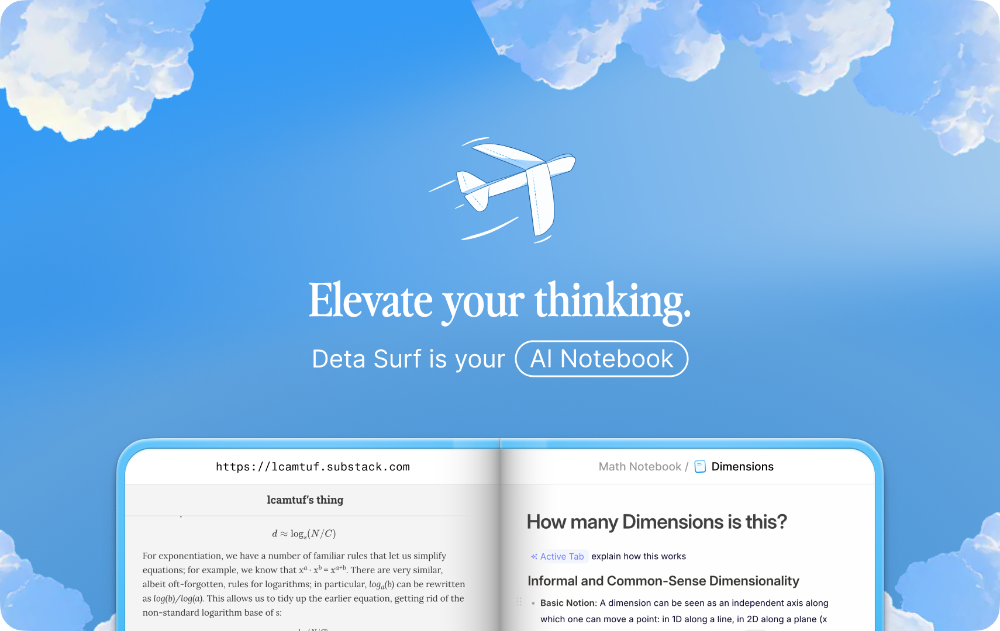
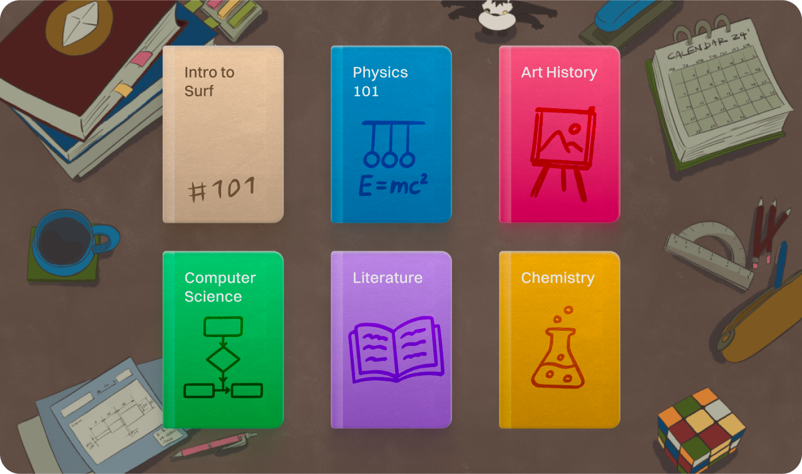
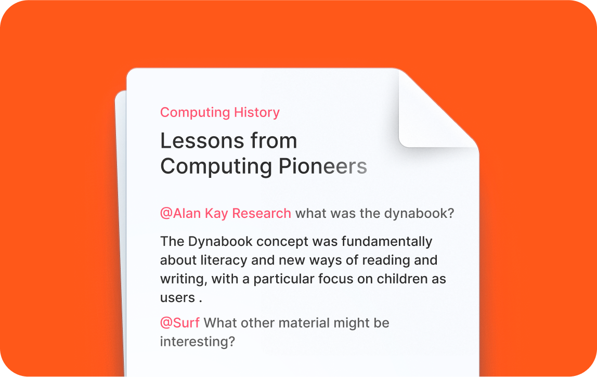
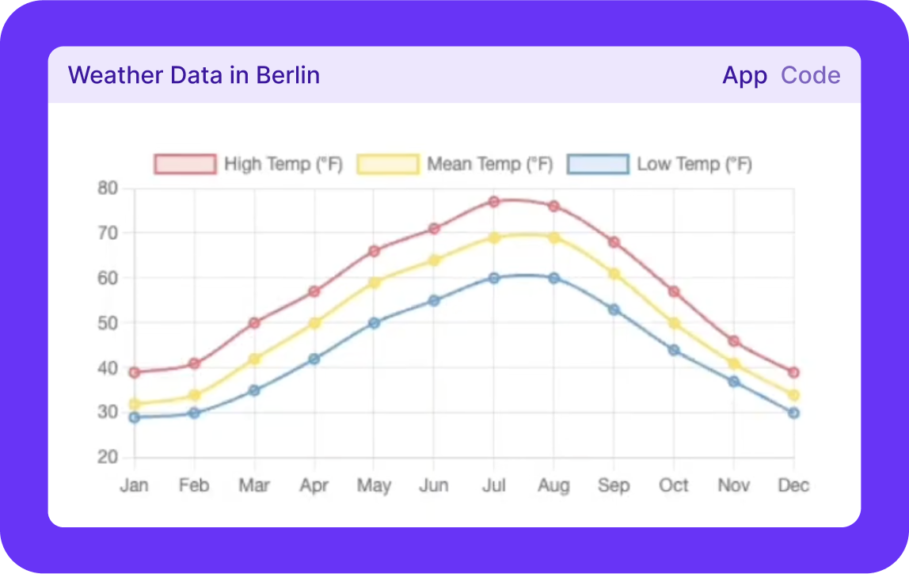

# 배움의 달인 - AI 기반 학습 노트북



**모든 지식을 하나로 통합하는 AI 학습 플랫폼**

[English](./README.md) | **한국어**

---

## 📄 저작권 고지

**배움의 달인 (Learning Master)**
Copyright 2025 김문정

이 프로젝트는 [Deta Surf](https://github.com/deta/surf)를 기반으로 한 파생 저작물입니다.

**원본 저작물:**
Deta Surf - Copyright 2025 Deta GmbH
Licensed under Apache License 2.0

**파생 저작물의 주요 수정 사항:**
- 애플리케이션 이름을 "배움의 달인"으로 변경
- 완전한 한국어 지원 시스템 구축
- BYOK 기반 다중 AI 제공자 통합 (Google Gemini 우선 지원)
- 사용자 선택 가능한 AI 모델 시스템

자세한 수정 내역은 [NOTICE](./NOTICE) 파일을 참조하세요.

**상표권 고지:** "Deta" 이름과 로고는 Deta GmbH의 상표이며 Apache 2.0 라이센스에 포함되지 않습니다. 이 파생 저작물은 "배움의 달인"으로 브랜딩되며 Deta GmbH와의 연관성이나 보증을 주장하지 않습니다.

---

## 소개

배움의 달인은 파일과 웹을 직접 학습 흐름에 통합하는 AI 노트북 애플리케이션입니다.

수동으로 검색하고, 창과 탭을 열고, 스크롤하고, 문서 편집기에 복사 붙여넣기 하는 번거로운 작업을 최소화하여 동시에 연구하고 생각할 수 있도록 설계되었습니다.

Svelte, TypeScript, Rust로 주로 제작되었으며, macOS, Windows, Linux에서 실행되고, 데이터를 로컬에 오픈 포맷으로 저장하는 오픈소스 소프트웨어입니다.


## 주요 특징

### ✨ 완전한 한국어 지원
- 모든 메뉴와 설정이 한국어로 제공됩니다
- 한국어 우선 사용자 경험
- 직관적인 한국어 인터페이스

### 🤖 BYOK (Bring Your Own Key) AI 통합
**자신만의 AI API 키로 2025년 최신 AI 모델 사용:**

#### 🌟 Google Gemini (우선 지원) - 2025년 최신
- **Gemini 2.5 Pro ⭐ NEW** - 최강력 모델, 적응형 사고, 1M 토큰 (곧 2M)
- **Gemini 2.5 Flash ⚡ NEW** - 고속 모델, 50% 토큰 절감
- **Gemini 2.5 Flash-Lite 🚀 NEW** - 초경량, 24% 토큰 절감, 비용 최적화
- **Gemini 2.0 Flash 🔥 NEW** - 실험적 차세대 모델, 멀티모달 강화
- Gemini 1.5 Pro - 안정적인 프로덕션 모델
- Gemini 1.5 Flash - 빠른 응답 속도

#### 🔥 OpenAI - 2025년 최신
- **GPT-4.5 Turbo 🔥 NEW** - 최신 최강 모델, 환각 37.1% (GPT-4o 61.8% 대비)
- **GPT-4o ⚡** - 현세대 주력 모델, 83% 가격 인하, 멀티모달
- **GPT-4o Mini 💰** - 초저비용 고효율 모델
- GPT-4 Turbo - 안정적인 프로덕션 모델
- GPT-3.5 Turbo - 레거시 모델

#### ⚡ Anthropic Claude - 2025년 최신
- **Claude Sonnet 4.5 ⭐ NEW** - 최강력 코딩/에이전트, 1M 토큰
- **Claude Opus 4.1 🔥 NEW** - 고급 추론 및 에이전트 최적화
- **Claude Haiku 4.5 ⚡ NEW** - 초저지연 모델
- Claude 3.7 Sonnet - 빠른 응답과 깊은 추론
- Claude 3 Opus - 레거시 안정 모델

#### 🔧 커스텀 API
- 자신만의 AI API 엔드포인트 연동 가능
- OpenAI 호환 API 지원

**AI 기능:**
- 📝 텍스트 요약
- 🌐 다국어 번역
- ✍️ 글쓰기 개선
- 💬 질문 답변
- 🎨 자동 생성 (Surflets)

### 📚 멀티미디어 라이브러리 & 노트북



거의 모든 미디어를 투명하고 오픈된 형식으로 컴퓨터의 개인 라이브러리에 저장합니다.

- 로컬 파일, 웹 사이트와 링크(YouTube, 트위터 등) 지원 또는 Surf에서 직접 미디어 생성
- 라이브러리를 노트북으로 구성
- 대부분의 라이브러리를 오프라인에서 열고 사용 가능
- 라이브러리를 활용하여 Surf의 AI 기능 강화

Surf의 라이브러리는 SFFS(Surf Flat File System)라는 로컬 스토리지 엔진 기반으로 오픈되고 투명한 형식으로 데이터를 저장합니다.

[라이브러리 상세 정보](/docs/LIBRARY.md)

### 🧠 스마트 노트



수많은 창을 열고, 클릭하고, 스크롤하고, 문서(또는 챗봇)에 복사 붙여넣기 하지 않고도 디지털 자료를 탐색하고 생각합니다.

- `@-언급`하여 탭, 웹사이트 또는 [라이브러리](./docs/LIBRARY.md)의 모든 리소스에서 자동 생성
- [웹 검색](./docs/SMART_NOTES.md#web-search)을 트리거하여 연구하고 결과를 노트에 가져오기
- 웹페이지의 섹션, 비디오의 타임스탬프, PDF의 페이지 등 원본 소스에 딥링크된 통합 [인용](./docs/SMART_NOTES.md#citations)
- [Surflets](./docs/Surflets.md)를 사용하여 코드 작성 없이 인터랙티브 애플리케이션 생성
- 다른 애플리케이션에서 이미지, 표 또는 데이터를 붙여넣고 Surf가 이를 이해하고 통합하도록 하기
- 노트에서 리치 포맷팅, 코드 블록, 할 일 목록 등 사용

[더 읽기](/docs/SMART_NOTES.md)

### 🖥️ 탭, 분할 뷰 & 사이드바


Surf는 쉬운 탐색을 위해 탭, 분할 뷰, 사이드바를 기반으로 제작되었습니다.

- 탭에서 로컬 노트, 파일 또는 웹 페이지 열기
- 분할 뷰를 통해 여러 리소스를 나란히 보고 상호작용
- 사이드바에서 노트북과 노트에 빠르게 액세스

### 🎨 Surflets (앱 생성)



Surf는 코드로 시각화, 이해 또는 개념이나 데이터 탐색을 돕는 인터랙티브 앱릿을 코딩할 수 있습니다.

[더 읽기](./docs/SURFLETS.md)

## 설치

### 사전 빌드된 설치 파일 다운로드

최신 안정 버전의 macOS, Windows, Linux용 배움의 달인을 [GitHub 릴리스](https://github.com/reallygood83/surf/releases)에서 확인하세요.

### 소스에서 빌드하기

```bash
# 저장소 클론
git clone https://github.com/reallygood83/surf.git
cd surf

# 의존성 설치
yarn install

# 개발 모드 실행
yarn dev

# 프로덕션 빌드
yarn build

# 플랫폼별 빌드
yarn build:desktop:mac    # macOS (Apple Silicon + Intel)
yarn build:desktop:win    # Windows (x64)
yarn build:desktop:lin    # Linux (x64)
```

상세한 개발 가이드는 [CONTRIBUTING.md](CONTRIBUTING.md)를 참조하세요.

## 빠른 시작

### 1. AI API 키 설정하기

**배움의 달인**은 BYOK (Bring Your Own Key) 방식을 사용합니다. 자신만의 AI API 키를 사용하세요:

#### Google Gemini (추천) ✨

1. [Google AI Studio](https://ai.google.dev/)에서 무료 API 키 발급
2. 배움의 달인 설정 > AI > Google Gemini 선택
3. API 키 입력 및 검증
4. 원하는 모델 선택 (Gemini 1.5 Pro 추천)

#### 기타 Provider

- **OpenAI**: [platform.openai.com](https://platform.openai.com/)
- **Anthropic**: [console.anthropic.com](https://console.anthropic.com/)

### 2. 시도해볼 기능들

- _YouTube 노트_: YouTube 영상을 방문하고 질문하기
- _PDF 노트_: PDF를 열고 질문하기
- _앱 생성_: "앱 생성" 도구를 사용하여 앱 요청하기
- _웹 검색 노트_: "웹 검색" 도구를 사용하고 "검색"이 포함된 질문하기

## 단축키

가장 일반적인 단축키는 [여기](./docs/SHORTCUTS.md)에서 확인하세요.

## 기술 스택

### 프론트엔드
- **프레임워크**: Svelte 5
- **언어**: TypeScript
- **빌드**: Vite + Electron Vite
- **UI**: Tailwind CSS

### 백엔드
- **언어**: Rust
- **Node 바인딩**: NEON
- **데이터베이스**: SQLite with WAL
- **스토리지**: SFFS (Surf Flat File System)

### AI 통합
- Google Gemini API
- OpenAI API
- Anthropic API
- 커스텀 API 지원

### 패키지 관리
- Yarn Workspaces (Monorepo)
- Turbo Build System

## 보안

_보안 문제 보고는_ https://github.com/reallygood83/surf/security/policy 참조

## 기여하기

프로젝트 기여에 대한 상세 정보와 코드베이스 개요는 [CONTRIBUTING.md](CONTRIBUTING.md)를 참조하세요.

## 행동 강령

행동 강령 상세 정보는 [CODE_OF_CONDUCT.md](CODE_OF_CONDUCT.md)를 참조하세요.

## 라이선스

이 프로젝트의 소스 코드는 Apache 2.0 라이선스로 제공되며, 다음 예외 사항이 있습니다:

1. @ghostery/adblocker-electron 패키지에 대한 패치는 업스트림 프로젝트의 라이선싱과 일관되게 Mozilla Public License 2.0 (MPL-2.0)으로 라이선스됩니다.
2. 선택된 파일에는 기본 라이선스를 대체하는 자체 특정 라이선스 헤더가 포함될 수 있습니다.

파일이나 디렉토리에 별도 명시가 없는 한, 모든 코드는 Apache 2.0 라이선스를 기본으로 합니다.

Apache 2.0 라이선스에 대한 자세한 내용은 [LICENSE](LICENSE)를 참조하세요.

**참고:** Deta 이름과 로고는 Deta GmbH의 상표이며 Apache 2.0 라이선스에 포함되지 **않습니다**.

## 감사의 글

이 프로젝트는 다음 오픈소스 패키지를 사용합니다 (전체 목록 아님):

- [Electron](https://www.electronjs.org/)
- [Tiptap](https://tiptap.dev/)
- [Svelte](https://svelte.dev/)
- [Rust](https://www.rust-lang.org/)

## 개발자

**프로젝트**: 배움의 달인 (Learning Master)
**원작**: Deta Surf
**커스터마이징**: 김문정
**라이선스**: Apache 2.0

---

**배움의 달인**으로 학습의 새로운 경험을 시작하세요! 🚀
