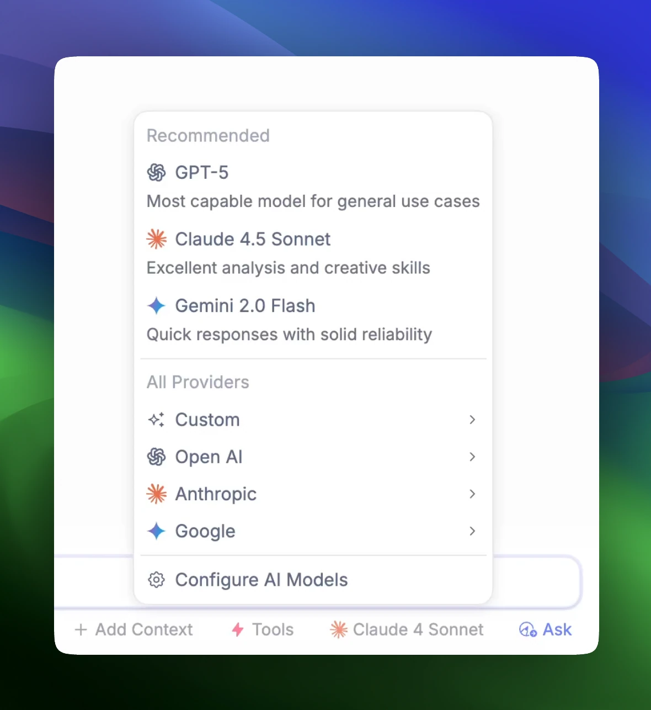
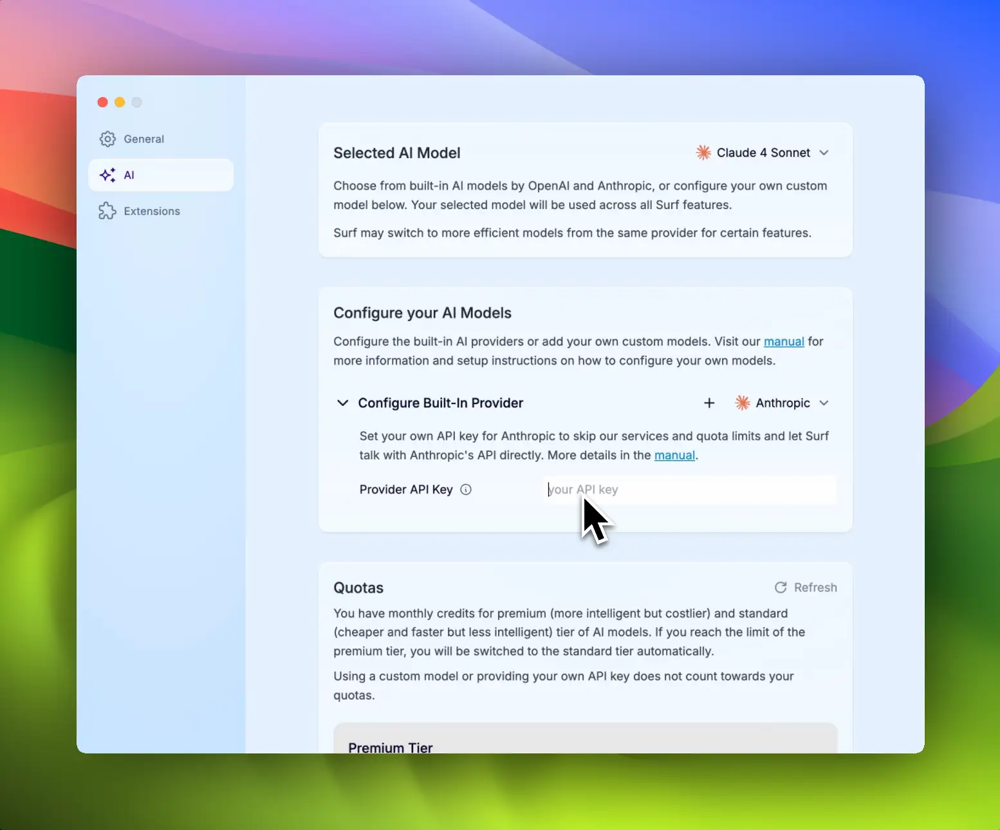
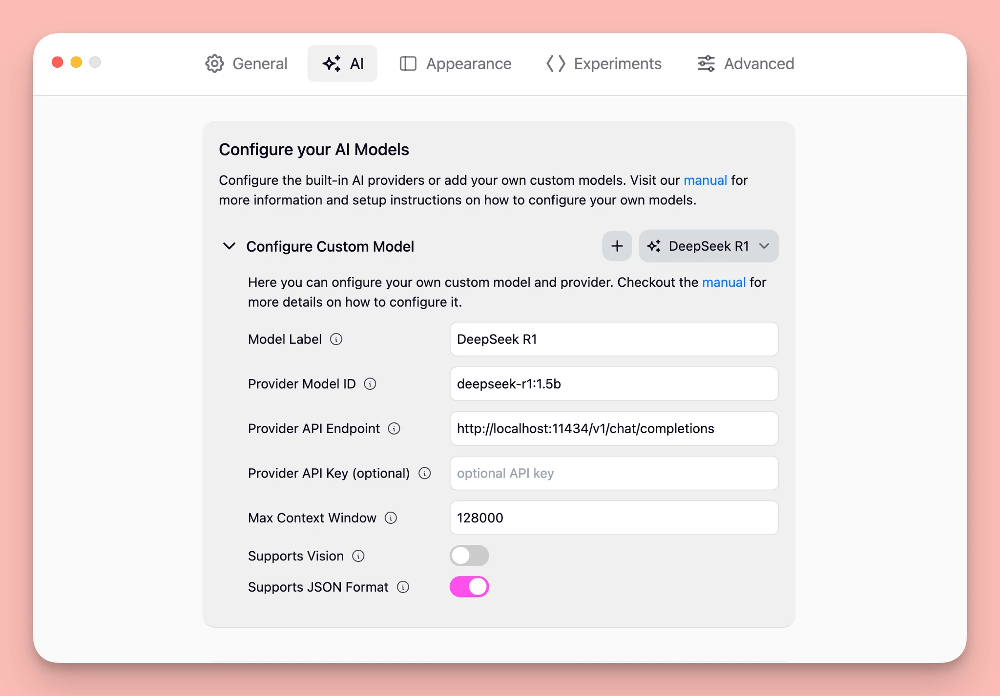

## AI Models in Surf

---

We believe the use of AI models in Surf should be open.

We've built a UI to switch between models on every query. We have architected Surf so that you can bring your own key for popular models or add your own custom model (either local or in the cloud).

Once added, your model will show up in the UI.

## Switching Models in Surf

---

Surf's interface allows you to easily switch between models on the fly and use the one that best fits your needs. Just select it in the switcher.

## Configuring the Built-In Models

---

You can enter your own API key by going to Preferences → AI and then selecting one of the built-in providers under “Configure your AI Models”.

Read [OpenAI’s](https://help.openai.com/en/articles/4936850-where-do-i-find-my-openai-api-key) help page or visit [Anthropic’s Claud Console](https://console.anthropic.com/settings/keys) for your API keys.

## Adding Your Own Model to Surf

---

If you have not yet setup your own AI model, follow the instructions for some [**common providers**](#common-providers) below. Once you have your model running, you can add it to Surf by following these steps:

1. Open the Surf settings through the app menu or using the shortcut `⌘/ctrl + ,`
2. Navigate to the “AI“ tab.
3. Click on the "Add Model" button under the "Configure your AI Models" section.
4. Give your model a name and most importantly, provide the URL where your model is hosted and the ID of the model itself.

The model URL should be the OpenAI compatible chat completions API endpoint where your model is hosted. The model ID is the unique identifier of your model. If your model requires an API key, you can provide it in the settings as well.

See below on what each configuration option means, you can usually find the required information in the documentation of your chosen provider.

Once you have added your model, you can start using it in Surf. Select it from the dropdown at the top of the settings page or from the Chat or Smart Notes editor.

## Configuration Options

---

Here is a list of the configuration options you can set when adding a new model to Surf:

| **Option**      | **Value**                                                                                                                                 |
| --------------- | ----------------------------------------------------------------------------------------------------------------------------------------- |
| Provider URL    | Full URL of the model provider's OpenAI compatible API endpoint, most likely follows this format `https://<hostname>/v1/chat/completions` |
| Model ID        | The unique identifier or name of the model provided by the model provider                                                                 |
| API Key         | If the model provider requires an API key, provide it here                                                                                |
| Context Size    | The maximum number of tokens for the context window, can usually be found in your provider's documentation                                |
| Supports Vision | Whether the model supports vision tasks, check the provider's documentation                                                               |
| Supports JSON   | Whether the model supports JSON output format, smaller or local models usually don't                                                      |

## Common Providers

---

### **Ollama - Local**

To use AI models running locally on your machine we recommend using [Ollama](https://ollama.com/). To get started follow their [quick start guide](https://github.com/ollama/ollama/blob/main/README.md#quickstart) to set it up locally and then use the following configuration options:

| **Option**      | **Value**                                                                                                       |
| --------------- | --------------------------------------------------------------------------------------------------------------- |
| Provider URL    | `http://localhost:11434/v1/chat/completions`                                                                    |
| Model ID        | The model name provided by Ollama, check their [model page](https://ollama.com/search) for all available models |
| API Key         | Can be left blank                                                                                               |
| Context Size    | run `ollama show <model name>` to see the context window size of your Ollama model                              |
| Supports Vision | Whether the model supports vision tasks, check the [model page](https://ollama.com/search) for more info        |
| Supports JSON   | for local models it's best to disable this                                                                      |

### OpenRouter - Hosted

To use models hosted by [OpenRouter](https://openrouter.ai/) first create an account, then generate an API key from their [settings page](https://openrouter.ai/settings/keys). Use the following configuration options to connect it to Surf:

| **Option**      | **Value**                                                                                                                 |
| --------------- | ------------------------------------------------------------------------------------------------------------------------- |
| Provider URL    | `https://openrouter.ai/api/v1/chat/completions`                                                                           |
| Model ID        | The model ID provided by OpenRouter, check their [**models page**](https://openrouter.ai/models) for all available models |
| API Key         | Your OpenRouter API key                                                                                                   |
| Context Size    | The maximum number of tokens for the context window                                                                       |
| Supports Vision | Whether the model supports vision tasks, check the [model page](https://openrouter.ai/models) for more info               |
| Supports JSON   | Whether the model supports a JSON output forma, smaller models usually don't                                              |

### Hugging Face (via Inference Providers) - Hosted

To use text generation models from [**Hugging Face**](https://huggingface.co/) you can use their routing service with one of their supported [**Inference Providers**](https://huggingface.co/blog/inference-providers) like [**Together AI**](https://together.ai).

As an example here’s how to use a Hugging Face model running on Together AI via Hugging Face:

1. Sign up to Hugging Face if you haven’t
2. Generate a [Access Token](https://huggingface.co/settings/tokens) in the Hugging Face settings
3. Select a model from [Hugging Face’s model page](https://huggingface.co/models?inference_provider=together&sort=trending) that supports Together AI as the Inference Provider and copy its ID (e.g. [DeepSeek R1](https://huggingface.co/deepseek-ai/DeepSeek-R1))
4. Add a new model in Surf’s AI settings and configure it like below:

| **Option**      | **Value**                                                                                                                                                          |
| --------------- | ------------------------------------------------------------------------------------------------------------------------------------------------------------------ |
| Provider URL    | `https://router.huggingface.co/together/v1/chat/completions`                                                                                                       |
| Model ID        | The model ID provided by Hugging Face, check their [**models page**](https://huggingface.co/models?inference_provider=together&sort=trending) for available models |
| API Key         | Your Hugging Face Access Token                                                                                                                                     |
| Context Size    | The maximum number of tokens for the context window, check the model page                                                                                          |
| Supports Vision | Whether the model supports vision tasks, check the model page                                                                                                      |
| Supports JSON   | Whether the model supports a JSON output format, smaller models usually don't                                                                                      |

### Hugging Face (via your own Inference Endpoint) - Hosted

You can also deploy your own [Inference Endpoint](https://endpoints.huggingface.co/) on Hugging Face and use that with Surf. First checkout their [guide on ho to create OpenAI compatible inference endpoint](https://huggingface.co/blog/tgi-messages-api) then add a new model in Surf’s AI settings and configure it like below:

| **Option**      | **Value**                                                                                                                                                      |
| --------------- | -------------------------------------------------------------------------------------------------------------------------------------------------------------- |
| Provider URL    | `https://api-inference.huggingface.co/models/`                                                                                                                 |
| Model ID        | The model ID provided by Hugging Face, check their [models page](https://huggingface.co/models?inference_provider=together&sort=trending) for available models |
| API Key         | Your Hugging Face Access Token                                                                                                                                 |
| Context Size    | The maximum number of tokens for the context window, check the model page                                                                                      |
| Supports Vision | Whether the model supports vision tasks, check the model page                                                                                                  |
| Supports JSON   | Whether the model supports a JSON output forma, smaller models usually don't                                                                                   |

### Other Providers

In theory any provider that offers a OpenAI compatible chat completions API should work with Surf. In practice some providers are not fully compatible and can come with their own quirks. The only way to know for sure if a given provider works is by trying it out. Refer to the [Configuration Options](https://www.notion.so/Configuration-Options-199a5244a717800081a7ce12cef7bd93?pvs=21) above on what information is needed.

If you do get a provider working please let us know on [**Discord**](https://discord.gg/AKaBGfRXbw) or via [**E-Mail**](mailto:hello@deta.surf) and we will add it to this list so others can easily set it up as well. If you run into issues let us know as well and we’ll see if we can add support for your provider.

## Managed AI

---

You can download a version of Surf with managed AI from the [Deta website](https://deta.surf/).
