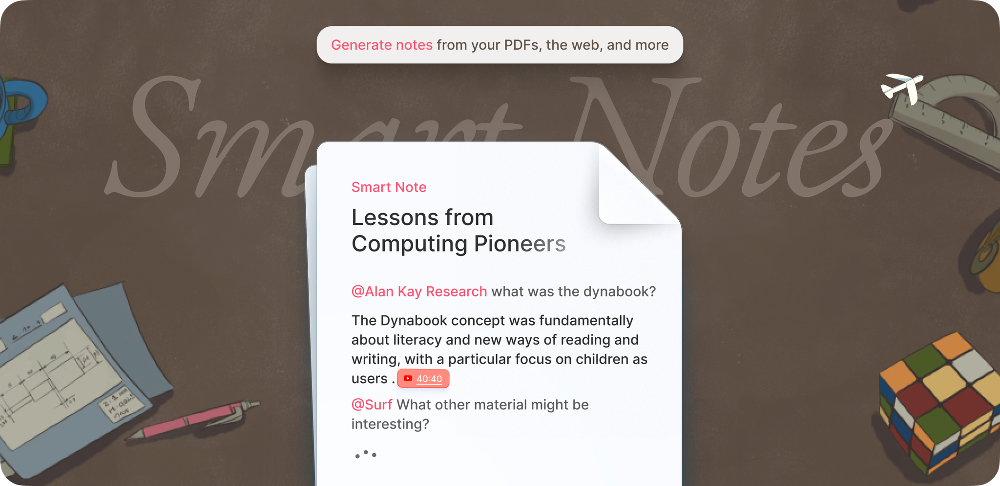
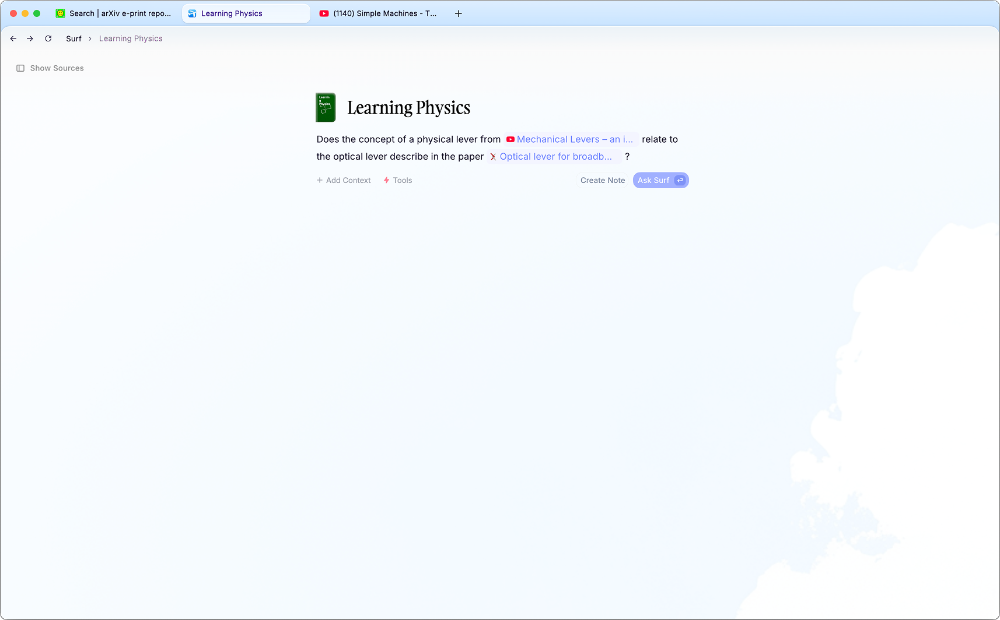
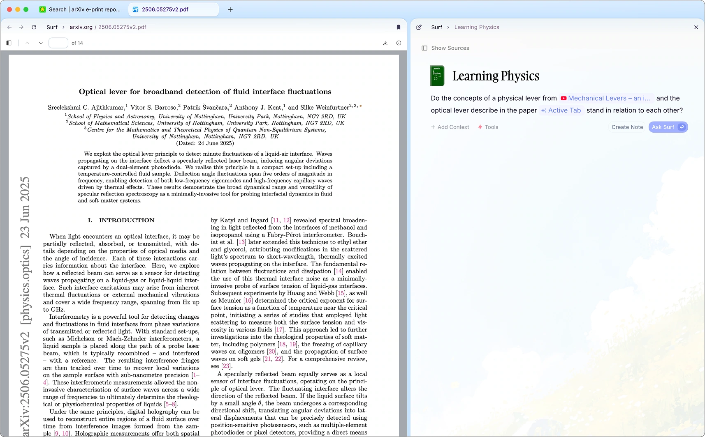
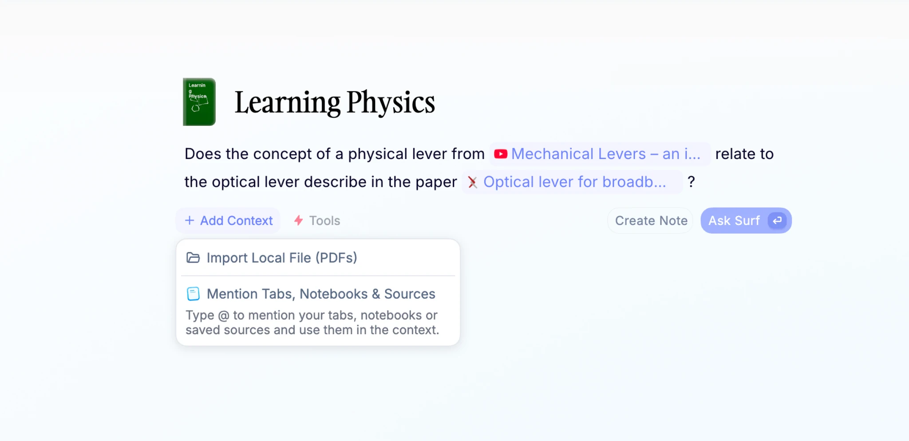
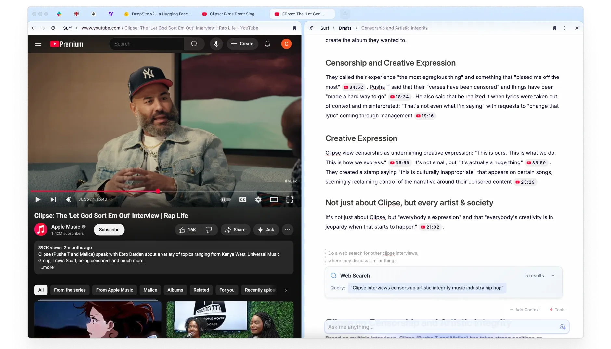
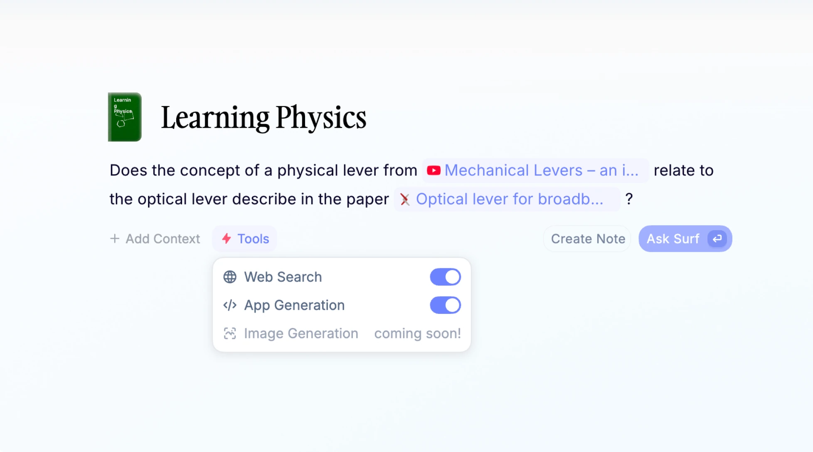
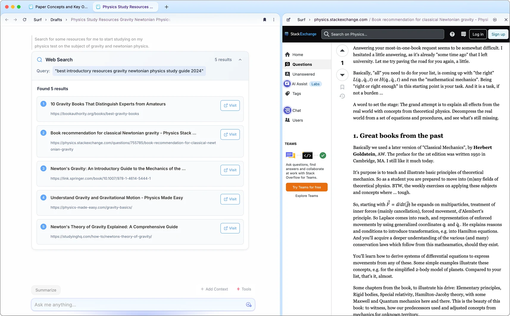
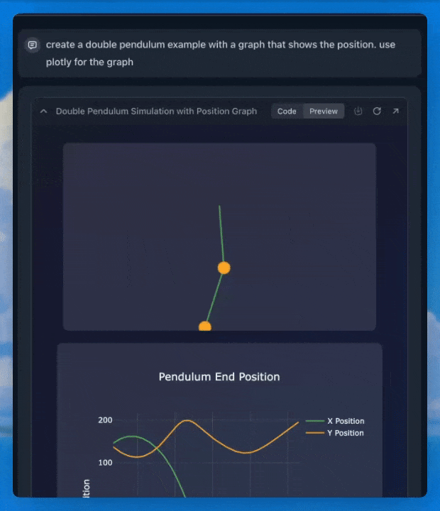

# Smart Notes

While chat is the standard interface for AI, we found it lacking.

**Smart Notes** combine a rich text editor with AI editing and writing features _powered by your own data_. They can be generated by and integrated with any content in Surf — an individual tab, a single resource, an entire Notebook, or the web.

## Creating a Smart Note

There are three ways to create a smart note — in a new tab or next to an existing tab.

In a new tab, start typing and then hit “ask Surf”. You can also create a naked note in a new tab by clicking “Notes” and “New Note”.

From an existing tab, hitting the “ask” button in the top right corner will trigger a split view, with the current tab added into the context of the smart note.

By default a note is saved in your “Drafts” notebook. To move it to another notebook, open the note and click the Surf button, or right click the note from your Library or a Notebook.

## @-mentions

Your notes have direct-access to anything you @mention — your tabs, other notes, saved PDFs, your notebooks, and so on. Typing the @ key will launch a menu which allows you to search everything in Surf, and then use it to explore your next thought. You can also add context manually via the button.

## / Menu

There is a slash (`/`) menu to the notes editor. Simply type a `/` and a new menu will show up letting you create basic elements like headings, lists and code blocks.

## Citations

Notes are generated from the context you specify, and include citations that bring you to the exact point which was used to generate the note — like a page on a PDF, a time stamp on a YouTube video or a section of a website.

_Pro tip: If you click any citation generated in a Surf Note, it navigates to where the information was pulled from, within a side-view._

## Split View

The split view is available across the notes UI - If you click any citation or source generated in a Surf Note, it navigates to where the information was pulled from, within a split-view. `Cmd / Ctrl + Click` if you want to open a citation in a normal tab.

## Autogenerated Prompts

When you open the chat it will now automatically generate and suggest a few prompts based on the content of the page you have open. This could for example be specific questions to ask about the topic thats discussed, or a summary of a key sections like “Historical Context”.

## Tools

Notes also have access to tools, which are available as toggles from the note controls at the bottom. The tools are web search and Surflets.

### Web Search

With Web search, you'll never have to leave your notebook to continue your research. The note can go out to the web, and come back with answers, backed by the web pages it found them from.

Toggle the websearch tool, and ask the AI to search for something.

### Surflets

A **Surflet** is a small applet that can take the shape of many things — such as a line chart, an interactive physics demo, or a fun game — created in your own words.

See [Surflets Documentation](./SURFLETS.md) for more details.
