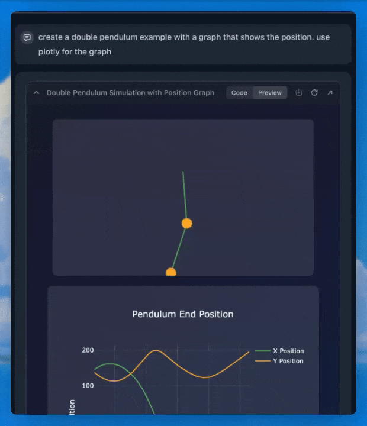

# Surflets

A **Surflet** is a small applet that can take the shape of many things — such as a line chart, an interactive physics demo, or a fun game — created in your own words.

If you toggle the Surflet tool on a generation, you can ask your note to generate you an app that can help you visualize data, or understand a concept, within your note.

Surflets can store data locally that is persisted between uses so you can create little applications like a todo list tracker that stores the state of your tasks, a game that persists the high score or anything else that needs its own state.

As with everything else in Surf, Surflets are stored in HTML files on your machine — so you can edit them in your favorite text editor!
